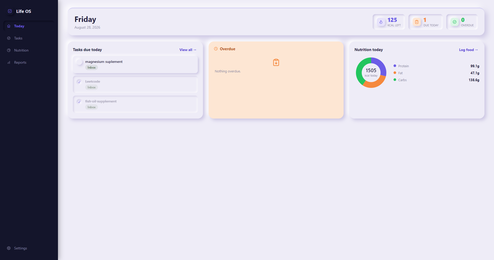

# 🗓️ Life OS

A neumorphic Windows desktop app that combines **task management** and
**nutrition tracking** in one place. Fully local, no account, no cloud sync.



---

## ✨ Features

**✅ Tasks**
- Daily / monthly / yearly recurring tasks that roll forward on completion
- Create projects on the fly, right from the task form
- Priority, notes, desktop reminders

**🍛 Nutrition**
- ~90 built-in home-style Indian dishes + [Open Food Facts](https://world.openfoodfacts.org/) for packaged products
- Custom foods with optional extended macros (sat fat, sugar, fiber, sodium)
- Edit any logged entry after the fact

**🤖 AI-assisted search** *(optional)*
- Drop in a free Gemini API key → search tries Gemini first, grounded with live Google Search
- Auto-falls back to Open Food Facts — leave it blank and nothing changes
- Results tagged **AI ESTIMATE**, always reviewable

**📸 Photo & label scanning**
- Snap a package → barcode/name lookup
- Snap a nutrition label → auto-fills the custom food form
- 100% offline OCR (Tesseract.js), zero cloud vision calls

**📊 Goals, charts & reports**
- Daily calorie/protein/fat/carb goals, donut + trend charts
- Day / Week / Month / Year trends and averages
- 📅 Calendar view — click any day to see exactly what you ate

---

## 🚀 Getting started

**Requires:** [Node.js](https://nodejs.org/) (LTS) + npm · Windows

```bash
git clone https://github.com/0pain01/Life-OS.git
cd Life-OS
npm install
npm start
```

Data stays local at `%APPDATA%/Daybook/data/daybook.sqlite3` — nothing leaves
your machine unless you add a Gemini key.

### 📦 Build a Windows exe

```bash
npm run dist
```

> ⚠️ Without Developer Mode enabled, the NSIS installer step may fail on a
> Windows symlink permission. The app itself still works fine at
> `dist/win-unpacked/Life OS.exe` either way.

---

## 🗂️ Project layout

```
electron/     main process — db, IPC, nutrition APIs, reminders
renderer/     UI — plain HTML/CSS/JS, one view module per screen
scripts/      app icon generator
build/        packaged app icon
```

---

## 📄 License

MIT — see [LICENSE](LICENSE)
